<div align="center">

<table border="0" cellpadding="16">
  <tr>
    <td align="center" width="200">
      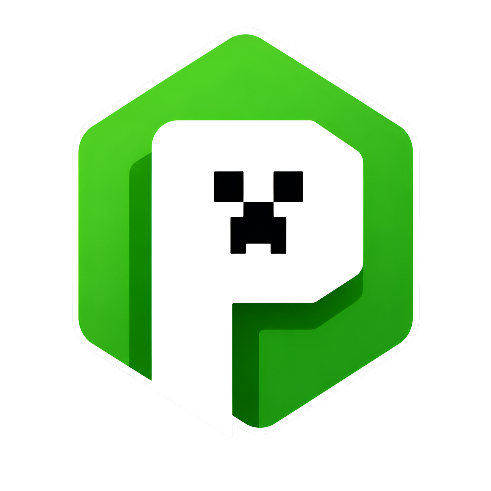
    </td>
    <td align="center">
      <h1 style="border: none; margin-bottom: 10px;">PocketMC Windows</h1>
      <p><b>Local-first Minecraft server management, without the terminal mess.</b></p>
      <p>Create, run, update, monitor, back up, and share Minecraft Java and Bedrock servers from one native Windows desktop app.</p>
      <a href="https://github.com/PocketMC/pocket-mc-windows/actions"></a>
      <a href="https://dotnet.microsoft.com/"></a>
      <a href="https://www.microsoft.com/windows"></a>
      <a href="LICENSE"></a>
      <a href="https://github.com/PocketMC/pocket-mc-windows/releases"></a>
      <a href="https://discord.gg/h27uNCaxPH"></a>
      <a href="https://www.reddit.com/r/PocketMC/"></a>
      <a href="https://www.youtube.com/@OfficialPocketMC"></a>
      <a href="https://www.buymeacoffee.com/sahaj33"></a>
    </td>
  </tr>
</table>

<br>
<video src="https://github.com/user-attachments/assets/1555998d-8f5c-4371-9caa-cf751f6b4f57" width="880" autoplay="autoplay"></video>
<br><br>

</div>

---

PocketMC is a native WPF/.NET 8 desktop app for local Minecraft server hosting. It handles software downloads, isolated instances, app-managed Java and PHP runtimes, startup and shutdown, live metrics, logs, players, backups, cloud replication, add-ons, Playit.gg tunnels, and a remote web dashboard — all in one polished Windows UI.

Your servers live on your machine, in the app root you choose. PocketMC is not a cloud host, not a Minecraft client launcher, and not a Linux web panel in a Windows costume.

<br>

## What changed without PocketMC vs. with it

| Before | After |
|--------|-------|
| Hunt the right JAR. Guess the Java version. Edit configs by hand. | Server software and runtimes managed entirely by the app. |
| Scattered terminal scripts and folders across the disk. | Isolated instances under one root — clean, auditable, portable. |
| Manual Playit tunnel setup on every machine. | Built-in agent provisioning, tunnel creation, and live status. |
| Backups when someone remembers to run a script. | Manual, scheduled, external-folder, and cloud backup flows. |
| Replacing server files and hoping the update holds. | Staged updates with planning, snapshots, journals, and rollback. |
| Staring at raw logs until something makes sense. | Persistent history, diagnostics, and optional AI session summaries. |
| Managing servers only from the host machine. | Remote web dashboard accessible from any device via browser or QR code. |

<br>

## Supported server software

<table border="0" align="center" cellpadding="8">
  <tr align="center">
    <td></td>
    <td></td>
    <td></td>
    <td></td>
    <td>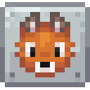</td>
    <td>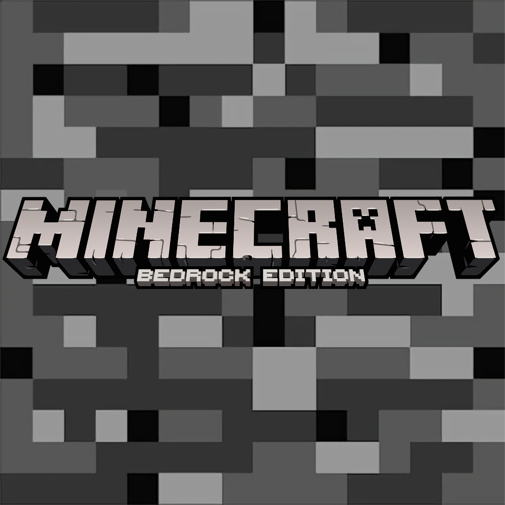</td>
    <td></td>
  </tr>
  <tr align="center" valign="top">
    <td><sub><b>Vanilla Java</b></sub></td>
    <td><sub><b>Paper</b></sub></td>
    <td><sub><b>Fabric</b></sub></td>
    <td><sub><b>Forge ⚠ beta</b></sub></td>
    <td><sub><b>NeoForge ⚠ beta</b></sub></td>
    <td><sub><b>Bedrock (BDS)</b></sub></td>
    <td><sub><b>PocketMine-MP</b></sub></td>
  </tr>
</table>

> **Note:** Forge and NeoForge support is in beta — expect instability.

<br>

## Features

<details open>
<summary><b>🖥️ &nbsp;Instance lifecycle</b></summary>
<br>

- Create isolated instances from the UI: server type, version, loader, seed, world type, gamemode, difficulty, player limit, EULA, custom world import.
- Start, stop, restart, and hard-kill servers from the dashboard or tray.
- Graceful shutdown via RCON with a console-input fallback.
- Crash detection with sanitized output capture and optional auto-restart with backoff.
- Per-instance port conflict checks before launch.
- Geyser-enabled instances patch Bedrock listener ports before starting.
- Power management: Windows sleep is automatically prevented while a server is running.
- Per-instance auto-start on app launch.

</details>

<details>
<summary><b>☕ &nbsp;Managed runtimes — zero Java headaches</b></summary>
<br>

- App-local Java provisioning through Adoptium: **Java 8, 11, 17, 21, and 25**.
- Automatic version selection based on Minecraft version:
  - 1.0 – 1.16.4 → Java 8
  - 1.16.5 – 1.17.1 → Java 11
  - 1.18 – 1.20.4 → Java 17
  - 1.20.5 – 1.21.1 → Java 21
  - 1.21.2+ → Java 25
- Java 25 downloaded in the background automatically. Older versions pulled only when a selected Minecraft version requires them.
- Custom Java path override for advanced users.
- PocketMine-MP uses an app-managed PHP 8.2 PM5 runtime — nothing to install globally.
- All downloads use retries, partial-file cleanup, safe promotion, and hash verification where upstream hashes exist.
- Missing bundled runtimes prompt for user confirmation before download or repair.

</details>

<details>
<summary><b>📊 &nbsp;Dashboard, metrics, and console</b></summary>
<br>

- Live CPU / RAM / player metrics for running instances.
- Dynamic Geyser/Floodgate and Simple Voice Chat badges.
- Console output is buffered, sanitized, classified, and persisted across sessions.
- Stopped or crashed servers can still open a read-only last-session log view.
- Large logs are tailed — no loading a 500 MB log file into the UI.
- Console tools: filter, search, command input, session history.

</details>

<details>
<summary><b>🌐 &nbsp;Public access via Playit.gg</b></summary>
<br>

- Built-in Playit agent provisioning and setup flow (simplified two-step wizard).
- Automatic tunnel discovery for matching instance ports.
- Auto-creates tunnels for Java, Bedrock, Geyser, PocketMine, and Simple Voice Chat when possible.
- Interactive Ports Map with local ports, public addresses, roles, and live tunnel status.
- Clear states for offline agents, invalid tokens, unclaimed agents, pending allocations, and account limits.

</details>

<details>
<summary><b>🔀 &nbsp;Java & Bedrock cross-play</b></summary>
<br>

- Geyser and Floodgate are provisioned automatically during server creation for supported Java server types.
- If cross-play setup fails for a given version or loader, the server is still created and cross-play can be added later from Server Settings.
- Simple Voice Chat is detected via JAR presence in `mods/` or `plugins/`, config file, or log parsing, and its port is automatically included in the Playit tunnel map.

</details>

<details>
<summary><b>🧩 &nbsp;Mods, plugins, packs, and add-ons</b></summary>
<br>

- Modrinth browser for server-side mods, plugins, and modpacks.
- CurseForge browser via your own API key.
- Poggit integration for PocketMine plugins.
- Map browser for world downloads.
- Dependency resolution where provider metadata supports it.
- Java metadata scanning: Fabric, Quilt, Forge, NeoForge, Bukkit/Paper plugin metadata, icons.
- Add-on inventory: display names, versions, loader types, side-support labels, warnings, update status.
- Enable/disable add-ons without manually renaming files.
- Manual add-on update installation with compatibility checks.
- Bedrock `.mcpack`, `.mcaddon`, `.zip` ingestion with manifest parsing and automatic pack registration.
- Marketplace installs validate staged files, extensions, filenames, hashes, dependency failures, and unsafe modpack overrides.

</details>

<details>
<summary><b>💾 &nbsp;Backups, cloud replication, and safe restore</b></summary>
<br>

- Manual and scheduled backups with retention pruning.
- Live-server backup: RCON save sync first, console save-command fallback.
- Locked and unsafe files (e.g. `session.lock`) skipped gracefully.
- Manifest entries include metadata, size deltas, checksums, and failure state.
- Cloud upload to **Google Drive**, **Dropbox**, and **OneDrive** with upload history and retention handling.
- Per-instance custom local and external-folder backup directories.
- Restore: checks ZIP integrity, validates checksums, extracts to staging, verifies world structure, backs up the current world, rolls back if apply fails.

</details>

<details>
<summary><b>👥 &nbsp;Player and server controls</b></summary>
<br>

- Online player parsing for Java, Bedrock, and PocketMine log formats.
- Ban, op, whitelist, and runtime command actions from the player management page.
- Whitelist support for `whitelist.json` (Java), `allowlist.json` (BDS), and `white-list.txt` (PocketMine).
- Runtime setting application path for safer config changes while a server is running.

</details>

<details>
<summary><b>🔄 &nbsp;Instance version updates</b></summary>
<br>

- Offline update workflow with target version selection and Java runtime requirement checks.
- Compatibility warnings for tracked marketplace add-ons.
- Staged artifact replacement with supported add-on migration.
- Pre-update snapshots, journals, and locks for safe application.
- Rollback when an update fails mid-apply.

</details>

<details>
<summary><b>📦 &nbsp;Instance import & export</b></summary>
<br>

- Export a complete instance (server files, world, add-ons, metadata) to a portable archive.
- Import an exported archive to restore or share an instance.
- Cancellation support throughout the import/export flow.
- Java exports include `eula.txt`, server properties, whitelist, ops, bans, and other root files.

</details>

<details>
<summary><b>🖱️ &nbsp;Remote Control Dashboard</b></summary>
<br>

- Browser-based dashboard for managing servers from any device.
- Start, stop, restart, view the live console, send commands, and manage players remotely.
- Secure internet exposure via built-in **Cloudflare Quick Tunnels** or **Playit.gg HTTPS tunnels**, or restrict to LAN only.
- QR code generated for both local and public URLs — scan to open on mobile instantly.
- Configurable host port (default: 25580) and per-feature access controls (console commands, player actions).
- Password-protected sessions with token lifetime configuration and active session visibility.
- **Discord integration:** link your Discord account and receive the public remote control URL directly in your DMs via the PocketMC Discord bot when a tunnel starts.
- Pairing authorization flow with revocable device sessions.

</details>

<details>
<summary><b>🤖 &nbsp;AI session summaries</b></summary>
<br>

Generates structured session summaries from server logs using your own API key or a local endpoint.

Supported providers: **Google Gemini**, **OpenAI**, **Anthropic Claude**, **Mistral AI**, **Groq**, **Ollama / compatible local endpoint**

Logs are preprocessed and sanitized (IPs, emails) before being sent. You own the API key and the provider choice. A desktop toast notification is shown when a summary completes, with a direct link to open it.

</details>

<details>
<summary><b>🔍 &nbsp;Diagnostics</b></summary>
<br>

- Dependency health monitoring for required services and runtimes.
- Port diagnostics snapshots with conflict classification and recovery recommendations.
- Diagnostic reporting service for structured issue capture.

</details>

<details>
<summary><b>🪟 &nbsp;Windows integration and app polish</b></summary>
<br>

- Toast notifications for server online, Playit agent connection, Remote Control availability, and AI summary completion — each individually toggleable in App Settings.
- Tray integration, minimize-to-tray, and start-with-Windows.
- Start minimized to tray on launch option.
- Single-instance enforcement: launching the app a second time brings the existing window to the foreground.
- `pocketmc://` custom URI protocol for deep linking (e.g., Discord bot integration).
- Velopack update integration with automatic updates.
- Windows UWP loopback helper for Minecraft Bedrock local access via `CheckNetIsolation.exe`.
- Mica, Acrylic, Wallpaper Blur, custom background image, and theme settings.
- Discord Rich Presence: server type, version, player count, uptime, download button.

</details>

<br>

## Screenshots

### Desktop App

| | |
| :---: | :---: |
| **Dashboard**<br>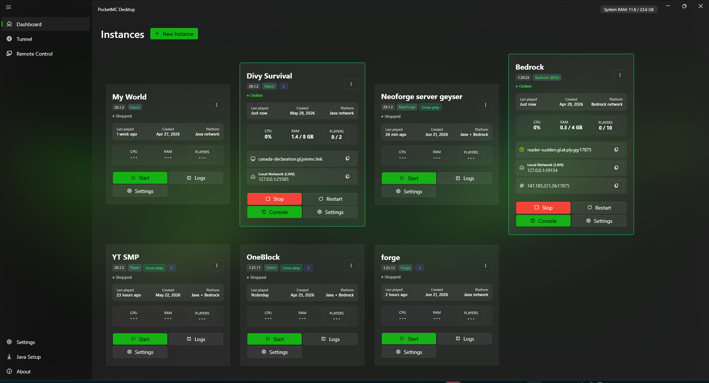 | **Console**<br>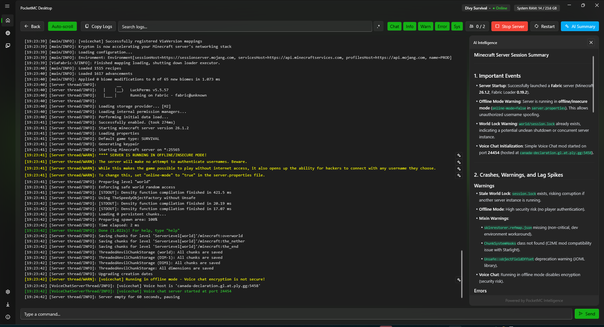 |
| **Server Settings**<br>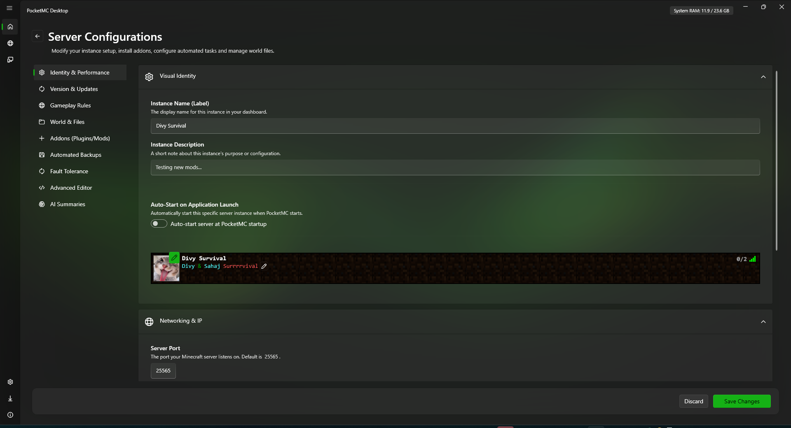 | **Backups**<br>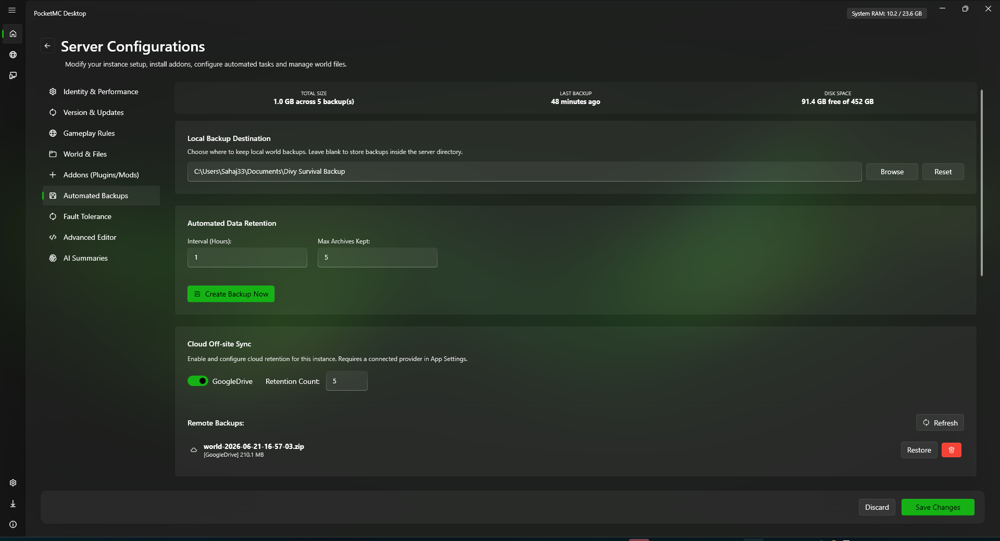 |
| **Mod Marketplace**<br>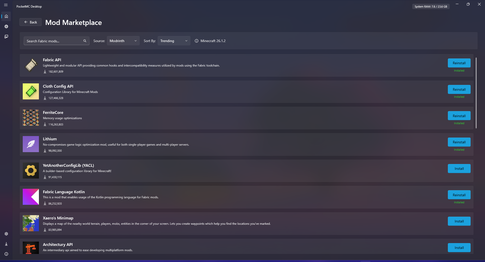 | **Mod Management**<br>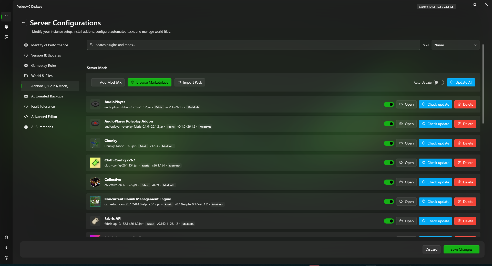 |
| **Plugin Management**<br>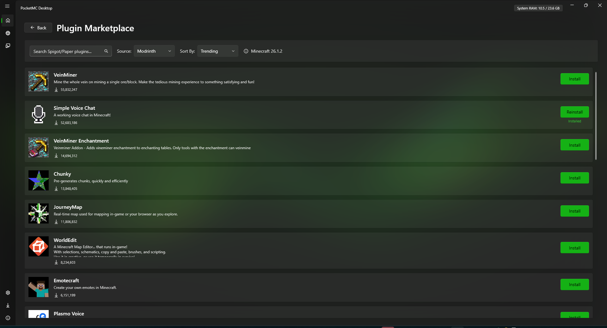 | **Java Runtimes**<br>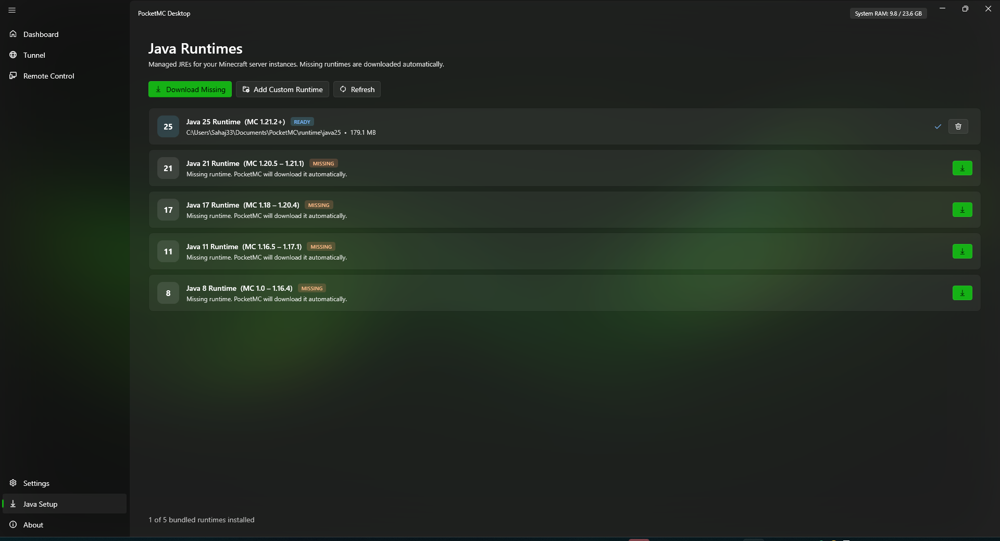 |
| **Public Tunnels**<br>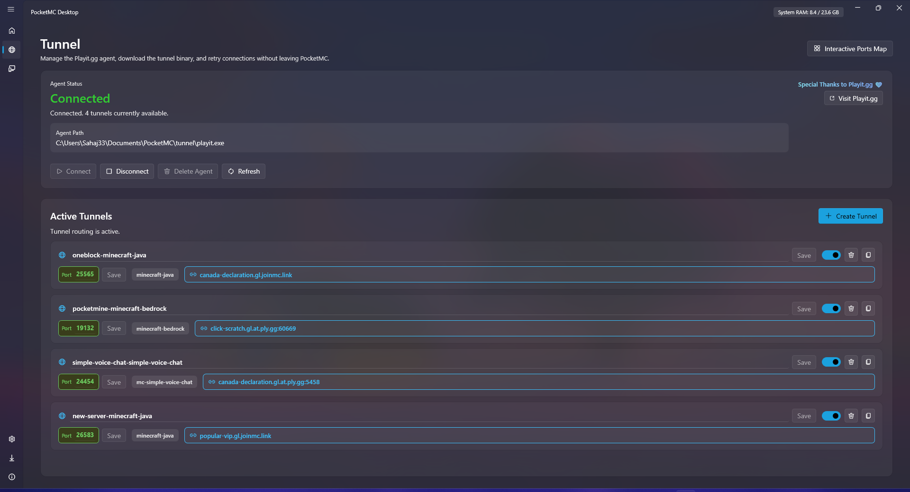 | **Interactive Ports Map**<br>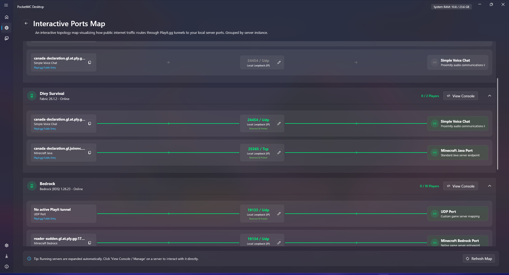 |
| **Remote Control**<br>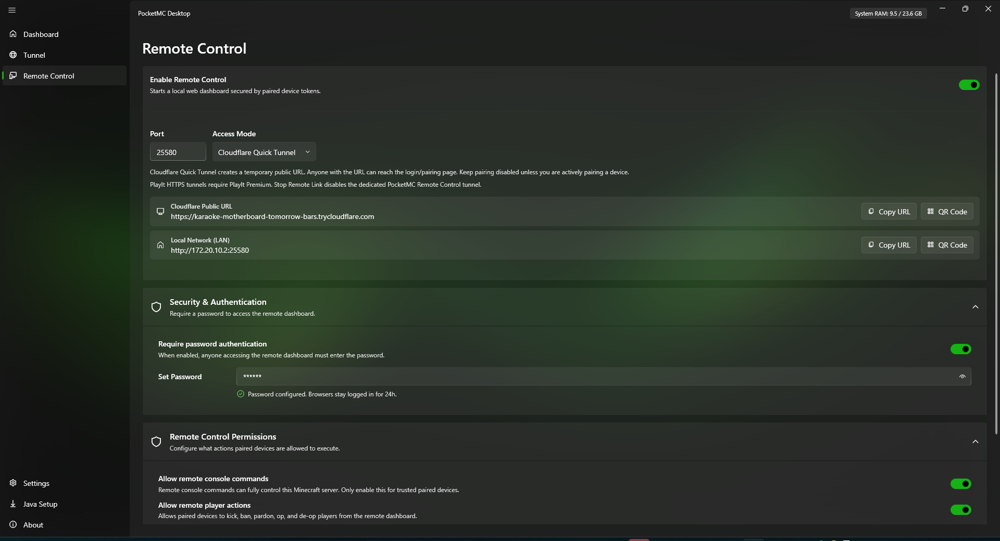 | **App Settings**<br>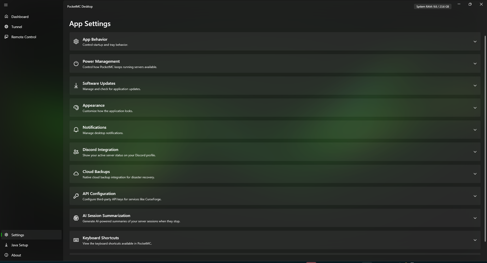 |
| **About Page**<br> | |

### Remote Web Dashboard

| Welcome | Login | Instances |
| :---: | :---: | :---: |
| 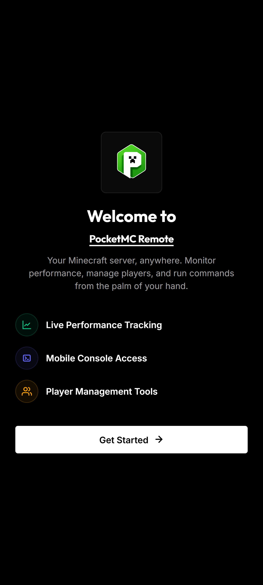 | 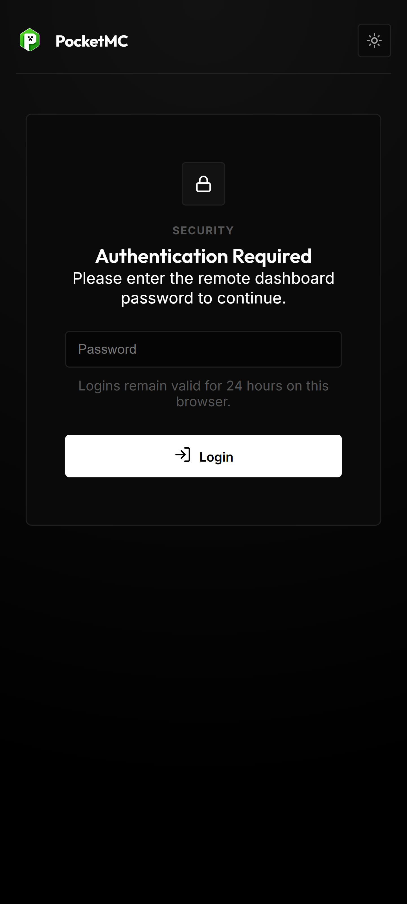 | 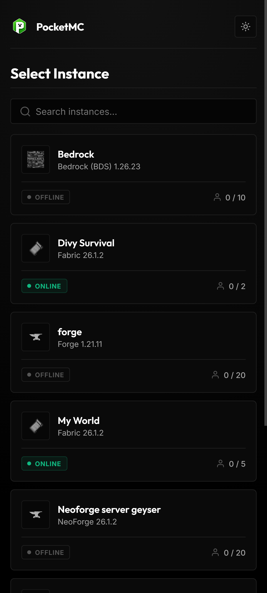 |
| **Home** | **Console** | **Players** |
| 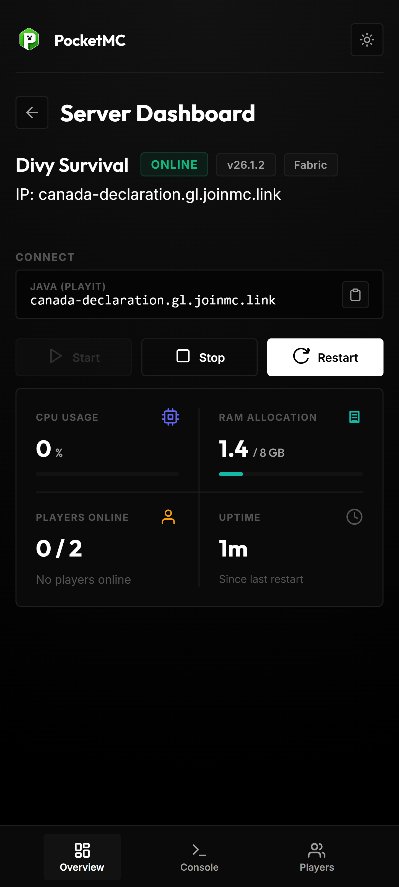 | 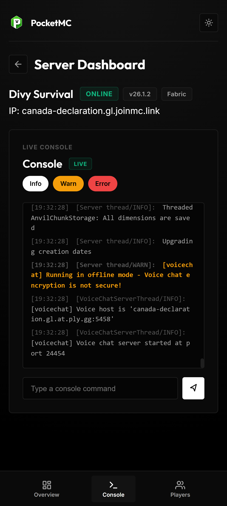 | 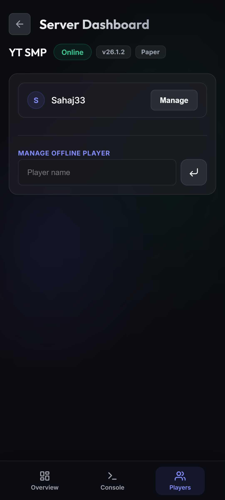 |

<br>

## Installation

Download [`Setup.exe`](https://github.com/PocketMC/pocket-mc-windows/releases/latest) from the latest release and run it.

- Installs per-user — no admin rights required.
- .NET 8 Desktop Runtime is required and prompted automatically if missing.
- Java and PHP do not need to be globally installed. PocketMC provisions its own runtimes.
- Updates are handled automatically through Velopack.

<br>

## Quick start

```
1.  Pick an app root folder      →  Stores instances, runtimes, backups, logs, and settings.
2.  Create an instance           →  Family, version, world settings, player limit, EULA.
3.  Start the server             →  Connect via localhost or LAN IP.
4.  (Optional) Add public access →  Link Playit.gg — PocketMC resolves or creates tunnels.
5.  (Optional) Install content   →  Modrinth, CurseForge, Poggit, or Bedrock add-on import.
6.  (Optional) Protect the world →  Manual / scheduled / external / cloud backups.
7.  (Optional) Remote access     →  Enable Remote Control — share the URL or scan the QR code.
8.  (Optional) Diagnose          →  Diagnostics, persistent logs, AI session summaries.
```

<br>

## System requirements

| | |
|---|---|
| **OS** | Windows 10 build 17763 (1809) or Windows 11 |
| **Architecture** | x64 |
| **RAM** | 4 GB minimum — 8 GB+ recommended |
| **Runtime** | .NET 8 Desktop Runtime |
| **Internet** | Required for first-run downloads, marketplace, cloud backups, updates, Playit.gg |

<br>

## Build from source

**Prerequisites:** Windows 10 1809+ or Windows 11 · .NET 8 SDK · Visual Studio 2022 with *Desktop development with .NET*, or JetBrains Rider

```bash
git clone https://github.com/PocketMC/pocket-mc-windows.git
cd pocket-mc-windows

dotnet restore
dotnet build
dotnet test
dotnet run --project PocketMC.Desktop/PocketMC.Desktop.csproj
```

For packaging, PocketMC uses Velopack. See [`CONTRIBUTING.md`](CONTRIBUTING.md) for the release packaging flow.

<br>

## Project structure

<details>
<summary>Expand</summary>
<br>

| Path | Purpose |
|------|---------|
| `PocketMC.Desktop/Composition` | Dependency injection and service registration |
| `PocketMC.Desktop/Core` | Shared interfaces, MVVM utilities, and presentation primitives |
| `PocketMC.Desktop/Infrastructure` | WPF/Windows integrations, dialogs, dispatcher, notifications, updates, loopback helper, single-instance enforcement, protocol registration, power management, filesystem/process helpers, and security utilities |
| `PocketMC.Desktop/Features/Dashboard` | Dashboard cards, metrics, actions, instance state, and quick controls |
| `PocketMC.Desktop/Features/InstanceCreation` | New instance wizard, version loading, EULA flow, world import, Geyser setup, and server downloads |
| `PocketMC.Desktop/Features/Instances` | Metadata, registry, lifecycle, launch config, providers, backups, updates, import/export, worlds, runtime config, and process management |
| `PocketMC.Desktop/Features/Java` | Java resolution, Adoptium provisioning, runtime validation, and custom path support |
| `PocketMC.Desktop/Features/CloudBackups` | Google Drive, Dropbox, OneDrive integrations, OAuth, upload history, retention, and path safety |
| `PocketMC.Desktop/Features/Tunnel` | Playit agent lifecycle, API client, provisioning, discovery, auto-creation, and ports map UI |
| `PocketMC.Desktop/Features/Networking` | Port checks, roles, Simple Voice Chat detection and config patching, tunnel-aware preflight, and diagnostic snapshots |
| `PocketMC.Desktop/Features/Marketplace` | Modrinth, CurseForge, Poggit, map browser, modpack parsing, dependency resolution, and install hardening |
| `PocketMC.Desktop/Features/Mods` | Java add-on inventory, toggles, update checks, Bedrock add-on install/uninstall, pack registration |
| `PocketMC.Desktop/Features/Console` | Filtering, sanitization, classification, persistent history, and display behavior |
| `PocketMC.Desktop/Features/Players` | Parsing, bans, operators, whitelist/allowlist, and player UI |
| `PocketMC.Desktop/Features/Diagnostics` | Dependency health monitoring, port diagnostics, and reporting |
| `PocketMC.Desktop/Features/RemoteControl` | Web dashboard host (ASP.NET Core), REST API, WebSocket console, Cloudflare/Playit tunnel providers, QR codes, Discord integration, and settings UI |
| `PocketMC.Desktop/Features/Settings` | App/server settings, runtime application, cloud config, appearance, notifications, and AI config |
| `PocketMC.Desktop/Features/Shell` | Main shell, navigation, tray, startup options, visual state, and coordination |
| `PocketMC.Desktop/Features/Intelligence` | AI API client (Gemini, OpenAI, Claude, Mistral, Groq, Ollama), session summarization, log preprocessing, markdown rendering, summary storage |
| `PocketMC.Desktop/Features/Setup` | First-run root directory setup, App Settings page, Java Setup page |
| `PocketMC.Desktop.Tests` | xUnit/Moq tests for lifecycle, process, settings, marketplace, tunnel, console, backups, cloud, add-ons, players, startup, and VM logic |

</details>

<br>

## Contributing

Fork the repo, branch off `master`, open a pull request with a clear explanation of what changed and why.

Before opening a PR:

```bash
dotnet build
dotnet test
```

For substantial changes touching process lifecycle, runtime provisioning, tunnel orchestration, update/rollback flows, backup safety, cloud uploads, marketplace installs, or filesystem security — open an issue first.

See [`CONTRIBUTING.md`](CONTRIBUTING.md) for the full packaging and release flow.

<br>

## Community & License

**Discord** — [discord.gg/h27uNCaxPH](https://discord.gg/h27uNCaxPH)  
**Reddit** — [r/PocketMC](https://www.reddit.com/r/PocketMC/)  
**YouTube** — [Watch Tutorials](https://www.youtube.com/@OfficialPocketMC)  
**MIT** © 2026 PocketMC Contributors — see [LICENSE](LICENSE)

<br>

<div align="center">

<a href="https://www.buymeacoffee.com/sahaj33" target="_blank">
  
</a>
<br>
<a href="https://deepwiki.com/PocketMC/pocket-mc-windows">
  
</a>

<br><br>

<sub>PocketMC runs servers on your Windows PC. It does not provide cloud hosting.<br>
Playit.gg, CurseForge, cloud providers, AI summaries, and Discord integration require their own accounts or API keys.</sub>

</div>
