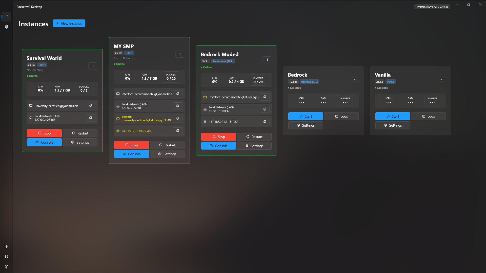
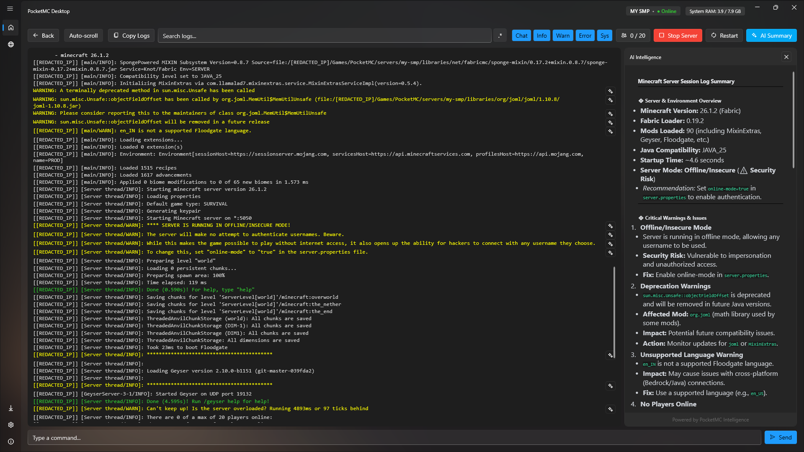
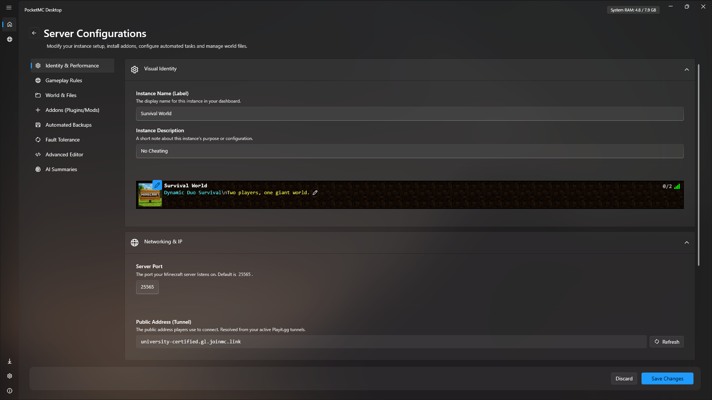
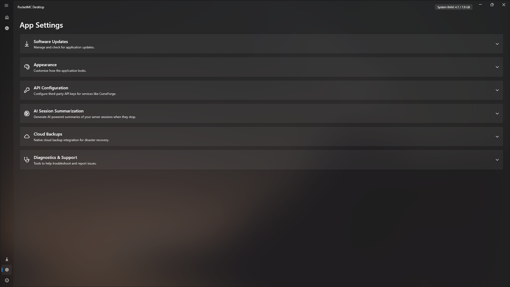
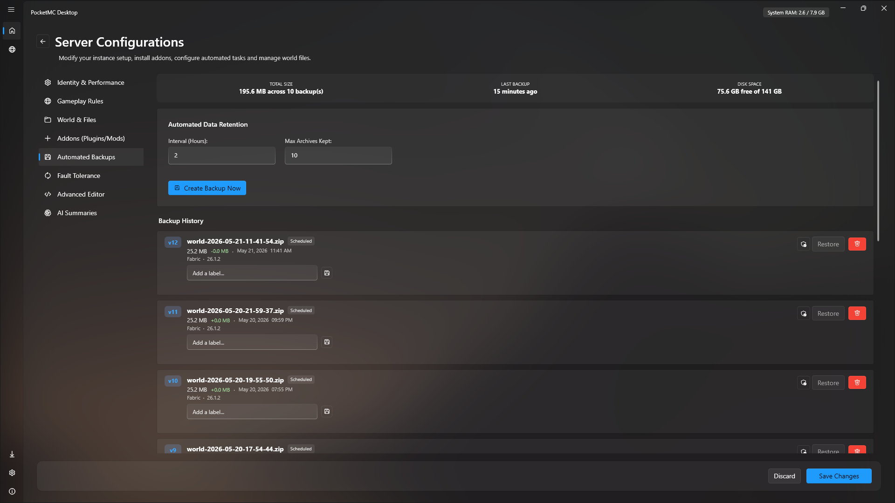
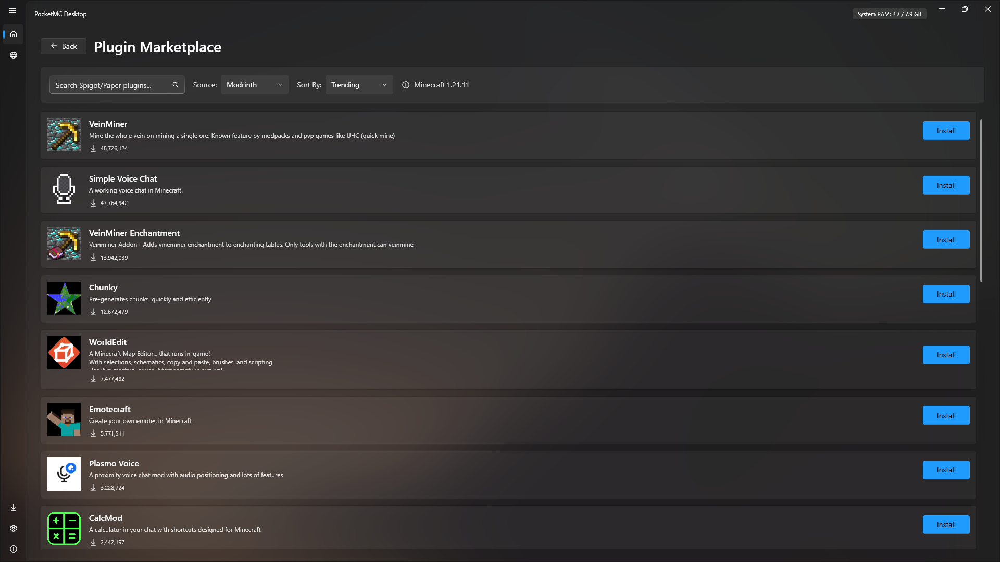
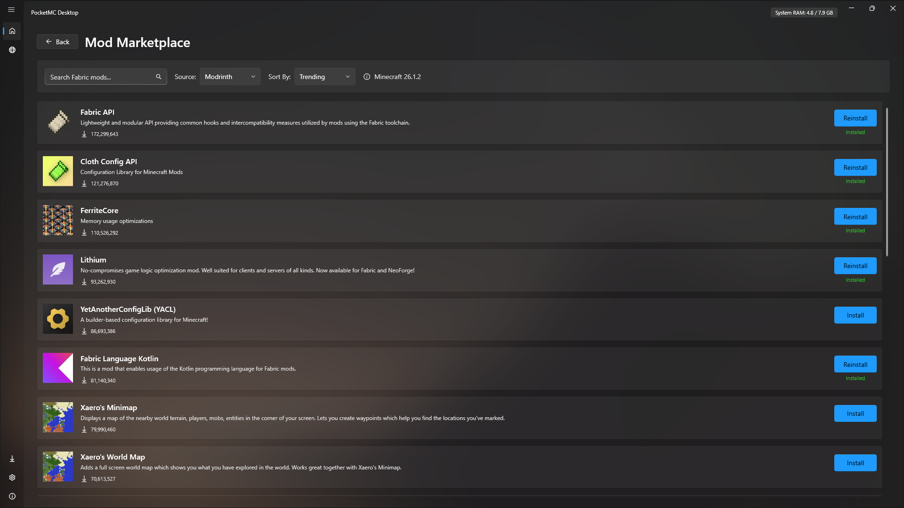
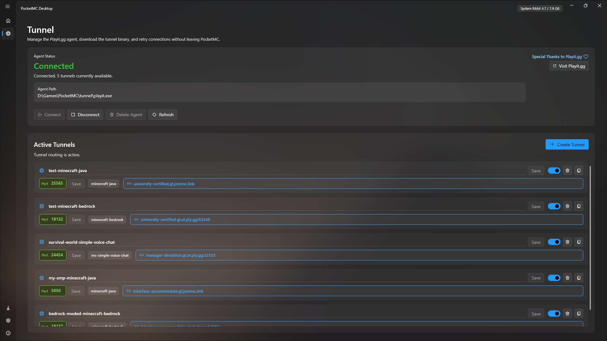
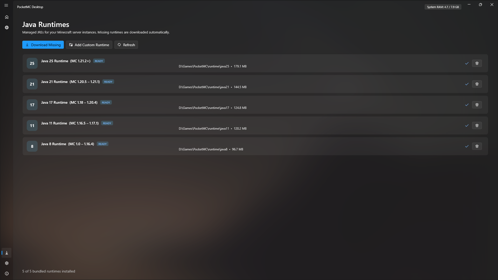
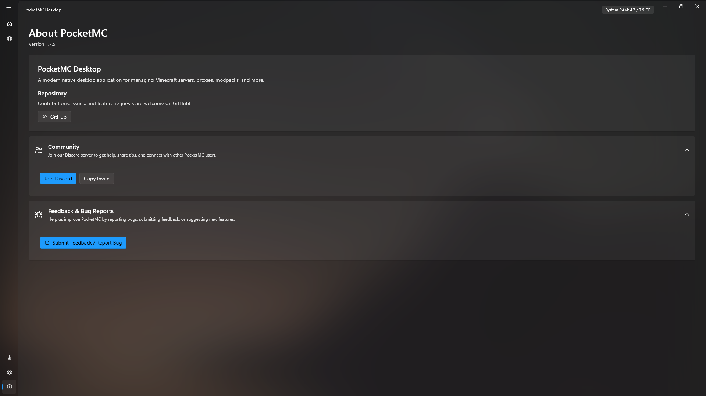

<div align="center">

<table border="0" cellpadding="16">
  <tr>
    <td align="center" width="200">
      
    </td>
    <td align="center">
      <h1 style="border: none; margin-bottom: 10px;">PocketMC Windows</h1>
      <p><b>Local-first Minecraft server management, without the terminal mess.</b></p>
      <p>Create, run, update, monitor, back up, and share Minecraft Java and Bedrock servers from one native Windows desktop app.</p>
      <a href="https://github.com/PocketMC/pocket-mc-windows/actions"></a>
      <a href="https://dotnet.microsoft.com/"></a>
      <a href="https://www.microsoft.com/windows"></a>
      <a href="LICENSE"></a>
      <a href="https://github.com/PocketMC/pocket-mc-windows/releases"></a>
      <a href="https://discord.gg/h27uNCaxPH"></a>
      <a href="https://www.buymeacoffee.com/sahaj33"></a>
    </td>
  </tr>
</table>



</div>

---

## What PocketMC is

PocketMC is a **native Windows WPF/.NET 8 desktop app** for people who want to host Minecraft servers locally without becoming a part-time terminal priest.

It manages server software downloads, isolated instance folders, app-local Java/PHP runtimes, startup/shutdown, live metrics, logs, players, backups, cloud replication, add-ons, updates, diagnostics, and Playit.gg tunnels from one desktop UI.

Your servers stay under the app root folder you choose. PocketMC is not a cloud host, not a Minecraft client launcher, and not a Linux/Docker web panel wearing a fake mustache.

---

## Why PocketMC exists

Running a local Minecraft server usually turns into this ritual:

1. Find the right server JAR.
2. Guess the right Java version.
3. Accept the EULA.
4. Edit config files by hand.
5. Open ports or set up tunneling.
6. Install plugins/mods.
7. Pray the console error is not a 200-line stack trace.
8. Back up the world after something already broke.

PocketMC turns that mess into a desktop workflow built for Windows users.

| Without PocketMC | With PocketMC |
|---|---|
| Manual JAR/PHP/Java setup | App-managed server downloads and runtimes |
| Terminal scripts and scattered folders | Isolated instances under one app root |
| Manual Playit tunnel setup | Built-in Playit agent and tunnel orchestration |
| Backups when someone remembers | Manual, scheduled, external, and cloud backup flows |
| Updating servers by replacing files and hoping | Planned instance updates with staging, snapshots, warnings, and rollback support |
| Guessing what broke from raw logs | Persistent console history, diagnostics, and optional AI summaries |

---

## Latest codebase highlights

Current `master` includes the v1.8.0 operations work plus newer unreleased reliability changes:

- **Instance version updates** with planning, staging, add-on migration, snapshots, journals, locks, and rollback support.
- **Persistent console history** for current sessions, last sessions, archived logs, and stopped/crashed instances.
- **Discord Rich Presence** using PocketMC's official Discord application ID, with server type, version, player count, uptime, and download button.
- **Interactive Ports Map** for local ports, Playit tunnels, role metadata, copy actions, and tunnel status.
- **Cloud backups** for Google Drive, Dropbox, and OneDrive, alongside local and external-folder backups.
- **Add-on inventory and toggles** for mods, plugins, packs, metadata, icons, side-support labels, warnings, disabled state, and update checks.
- **Whitelist/player management** across Java, Bedrock Dedicated Server, and PocketMine-style formats.
- **Safer restore and marketplace paths** with checksum checks, staged extraction, path traversal protection, dependency failure handling, and stricter archive validation.
- **Simple Voice Chat tunnel support** using Playit tunnel type `mc-simple-voice-chat` when the server needs it.
- **Windows startup/tray behavior** including start with Windows, start minimized to tray, minimize-to-tray-on-close, and safer auto-start handling.

---

## Supported server software

PocketMC resolves versions through upstream APIs/manifests where possible. Exact availability depends on the upstream project, because apparently even computers need supply chains now.

| Server family | Support in PocketMC |
|---|---|
| Vanilla Java | Official Mojang server JARs, Minecraft 1.8.8+ |
| Paper | PaperMC builds through the modern Paper API |
| Fabric | Fabric server JARs, Minecraft 1.14+ with loader selection |
| Forge | Installer-based Forge server setup, marked beta in the creation flow |
| NeoForge | Installer-based NeoForge server setup from Maven metadata, marked beta in the creation flow |
| Bedrock Dedicated Server | Windows BDS ZIP extraction from Bedrock server metadata, including previews when available |
| PocketMine-MP | PocketMine-MP `.phar` releases with managed PHP runtime support |
| Java ↔ Bedrock cross-play | Geyser/Floodgate provisioning for supported Java server types |
| Simple Voice Chat | Detection and Playit `mc-simple-voice-chat` tunnel orchestration |

---

## Feature map

<details open>
<summary><b>Instance creation and lifecycle</b></summary>

- Create isolated server instances from the desktop UI.
- Choose server type, version, loader version, seed, world type, gamemode, difficulty, and player limit.
- Import custom world archives during instance creation.
- Accept the Minecraft EULA during setup.
- Start, stop, restart, and kill servers from the dashboard or tray flow.
- Graceful shutdown uses RCON when available, then falls back to console input.
- Crash detection captures sanitized output and can trigger automatic restart with backoff.
- Per-instance port checks catch local conflicts before launch.
- Geyser-enabled instances patch Bedrock listener ports before launch.

</details>

<details>
<summary><b>Managed runtimes: zero Java headaches</b></summary>

- App-local Java provisioning through Adoptium.
- Runtime targets: **Java 8, 11, 17, 21, and 25**.
- Background setup downloads Java 25 by default.
- Older Java versions are downloaded only when a selected Minecraft version needs them.
- Custom Java path support is available for advanced users.
- PocketMine-MP uses an app-managed PHP 8.2 PM5 runtime.
- Downloads use retries, partial-file cleanup, safe promotion, and hash verification where upstream hashes are available.

</details>

<details>
<summary><b>Dashboard, metrics, console, and logs</b></summary>

- Dashboard cards show instance state, server type, version, player count, and live context.
- Live CPU/RAM/player metrics for running instances.
- Dynamic badges for Geyser/Floodgate cross-play and Simple Voice Chat detection.
- Console output is buffered, sanitized, classified, and stored.
- Persistent log history supports current, previous, archived, and legacy session logs.
- Stopped or crashed servers can still open read-only last-session console history.
- Large logs are tailed instead of loading the entire file into the UI.
- Console tools include filtering, search-oriented handling, command input, and session history.

</details>

<details>
<summary><b>Public access with Playit.gg</b></summary>

- Built-in Playit.gg agent provisioning and setup flow.
- Existing tunnel discovery for matching instance ports.
- Automatic tunnel creation for Java, Bedrock, Geyser, PocketMine, and Simple Voice Chat ports when possible.
- Public and numeric tunnel addresses shown in the app.
- Interactive Ports Map for local ports, public tunnel addresses, roles, and status.
- Clear handling for offline agents, invalid tokens, unclaimed agents, pending allocations, and account tunnel limits.

</details>

<details>
<summary><b>Mods, plugins, packs, and add-ons</b></summary>

- Modrinth browser for server-side mods, plugins, and modpacks.
- CurseForge browser support through the user's own CurseForge API key.
- Poggit integration for PocketMine plugins.
- Marketplace installs can resolve dependencies where provider metadata supports it.
- Java metadata scanning for Fabric, Quilt, Forge, NeoForge, legacy Forge, Bukkit/Paper plugin metadata, and icons.
- Add-on inventory shows display names, versions, filenames, loader types, side-support labels, warnings, and update status.
- Add-ons can be enabled or disabled without manual file renaming.
- Bedrock `.mcpack`, `.mcaddon`, and `.zip` ingestion with manifest parsing.
- Bedrock behavior/resource packs are copied into BDS folders and registered in the active world's JSON pack lists.
- Safer marketplace installs validate staged files, expected extensions, filenames, hashes, dependency failures, and unsafe modpack overrides.

</details>

<details>
<summary><b>Backups, cloud replication, and restore safety</b></summary>

- Manual and scheduled world backups.
- Live-server backup flow tries RCON save synchronization first, then console save commands.
- Locked files and unsafe files such as `session.lock` are skipped safely.
- Backup manifest entries include metadata, size deltas, checksums, and failure state.
- Backup retention pruning keeps old archives under control.
- Restore verifies ZIP readability and stored checksums when available.
- Restore extracts to a staging folder, validates world structure, backs up the current world, and rolls back if applying the restore fails.
- Per-instance custom local backup directory support.
- External backup replication to a selected folder.
- Cloud upload support for **Google Drive**, **Dropbox**, and **OneDrive**, with upload history and retention handling.

</details>

<details>
<summary><b>Player and server controls</b></summary>

- Online player parsing for Java, Bedrock, and PocketMine-style output.
- Player management page for server actions.
- Ban/operator sidecar management.
- Whitelist support for Java `whitelist.json`, Bedrock `allowlist.json`, and PocketMine `white-list.txt`.
- Runtime setting application path for safer configuration changes while servers are running.

</details>

<details>
<summary><b>Instance version updates</b></summary>

- Update workflow for stopped server instances.
- Target version selection and Java runtime requirement checks.
- Compatibility warnings for tracked marketplace add-ons.
- Staged update application for server artifacts and supported add-on migrations.
- Backup-aware planning with snapshots before risky changes.
- Journals and locks for safer update application.
- Rollback support when an update fails.

</details>

<details>
<summary><b>Diagnostics, Windows integration, and app polish</b></summary>

- Dependency health checks for Playit.gg, Adoptium, Modrinth, and related providers.
- Diagnostic reporting and support-bundle style data collection.
- Windows toast notifications.
- Tray integration and safer close/startup behavior.
- Start with Windows, start minimized to tray, and minimize-to-tray-on-close settings.
- Velopack startup/update integration.
- Windows UWP loopback helper for Minecraft Bedrock local loopback access through `CheckNetIsolation.exe`.
- Mica, Acrylic, Wallpaper Blur, custom background image, and theme settings.

</details>

<details>
<summary><b>AI session summaries</b></summary>

PocketMC can generate structured summaries from server session logs using a user-supplied API key or local endpoint.

Supported providers:

- Google Gemini
- OpenAI
- Anthropic Claude
- Mistral AI
- Groq
- Ollama / compatible local endpoint

Logs are preprocessed before summarization. PocketMC sanitizes obvious personal data such as IP addresses and emails before storing/exporting console output, but AI summaries still send processed log content to the provider you select.

</details>

---

## Installation

Download `Setup.exe` from the [latest release](https://github.com/PocketMC/pocket-mc-windows/releases/latest) and run it.

- Installs per-user; admin rights are not required for normal installation.
- .NET 8 Desktop Runtime is required and should be prompted if missing.
- Java does not need to be installed globally. PocketMC manages its own Java runtimes.
- PHP does not need to be installed globally for PocketMine-MP. PocketMC provisions the required runtime.
- Updates are handled through Velopack.

---

## Quick start

1. **Choose an app root folder.** This stores instances, runtimes, backups, logs, settings, and tunnel files.
2. **Create an instance.** Pick a server family, Minecraft version, loader version if needed, world settings, player limit, and EULA state.
3. **Start the server.** Use the dashboard start button. Connect locally with `localhost` or from LAN using your PC's local IP.
4. **Optional: add public access.** Link Playit.gg and let PocketMC resolve or create matching tunnels.
5. **Optional: install content.** Use Modrinth, CurseForge, Poggit, or Bedrock add-on import flows.
6. **Optional: protect the world.** Configure manual/scheduled backups, external replication, cloud backups, and update snapshots.
7. **Optional: diagnose and summarize.** Use diagnostics, persistent logs, and AI summaries when the console starts screaming in fluent Java.

---

## Screenshots

| Dashboard | Server Console |
|-----------|---------------|
|  |  |

| Server Settings | App Settings | Backups |
|-----------------|--------------|---------|
|  |  |  |

| Plugin Browser | Mod Marketplace |
|----------------|-----------------|
|  |  |

| Public Tunnels | Managed Runtimes | About |
|----------------|------------------|-------|
|  |  |  |

---

## System requirements

| Requirement | Minimum |
|---|---|
| OS | Windows 10 1809, build 17763, or Windows 11 |
| Architecture | x64 |
| RAM | 4 GB minimum, 8 GB+ recommended |
| Runtime | .NET 8 Desktop Runtime |
| Internet | Required for first-run server/runtime downloads, provider metadata, marketplace browsing, updates, cloud backup auth/uploads, and Playit.gg |

---

## Build from source

### Prerequisites

- Windows 10 1809+ or Windows 11
- .NET 8 SDK
- Visual Studio 2022 with **Desktop development with .NET**, or JetBrains Rider

### Commands

```bash
git clone https://github.com/PocketMC/pocket-mc-windows.git
cd pocket-mc-windows

dotnet restore
dotnet build
dotnet test
dotnet run --project PocketMC.Desktop/PocketMC.Desktop.csproj
```

For packaging, PocketMC uses Velopack. See [`CONTRIBUTING.md`](CONTRIBUTING.md) for the release packaging flow.

---

## Project structure

| Path | Purpose |
|---|---|
| `PocketMC.Desktop/Composition` | Dependency injection and service registration |
| `PocketMC.Desktop/Core` | Shared interfaces, MVVM utilities, and presentation primitives |
| `PocketMC.Desktop/Infrastructure` | WPF/Windows integrations, dialogs, dispatcher, notifications, updates, loopback helper, filesystem/process helpers, and security utilities |
| `PocketMC.Desktop/Features/Dashboard` | Dashboard cards, metrics, actions, instance state, and quick server controls |
| `PocketMC.Desktop/Features/InstanceCreation` | New instance wizard, version loading, EULA flow, world import, Geyser setup, and server downloads |
| `PocketMC.Desktop/Features/Instances` | Instance metadata, registry, lifecycle, launch configuration, providers, backups, updates, worlds, runtime configuration, and server process management |
| `PocketMC.Desktop/Features/Java` | Java version resolution, Adoptium runtime provisioning, runtime validation, and custom Java paths |
| `PocketMC.Desktop/Features/CloudBackups` | Google Drive, Dropbox, and OneDrive backup provider integrations, OAuth helpers, upload history, retention, and cloud path safety |
| `PocketMC.Desktop/Features/Tunnel` | Playit.gg agent lifecycle, API client, partner/agent provisioning, tunnel setup, discovery, auto-creation, and ports map UI |
| `PocketMC.Desktop/Features/Networking` | Port checks, port roles, Simple Voice Chat config parsing, tunnel-aware preflight, and diagnostics snapshots |
| `PocketMC.Desktop/Features/Marketplace` | Modrinth, CurseForge, Poggit, modpack parsing, dependency resolution, marketplace models, and install hardening |
| `PocketMC.Desktop/Features/Mods` | Java add-on inventory, toggles, update checks, Bedrock add-on install/uninstall, and pack registration |
| `PocketMC.Desktop/Features/Console` | Console filtering, sanitization, classification, persistent history, and display behavior |
| `PocketMC.Desktop/Features/Players` | Player parsing, bans, operators, allowlist/whitelist handling, and player UI |
| `PocketMC.Desktop/Features/Diagnostics` | Dependency health, port diagnostics, and diagnostic reporting |
| `PocketMC.Desktop/Features/Settings` | App/server settings pages, settings view models, runtime setting application, add-ons, cloud backups, appearance, and AI config |
| `PocketMC.Desktop/Features/Shell` | Main shell, navigation, tray UI, startup options, visual state, and startup coordination |
| `PocketMC.Desktop/Features/Intelligence` | AI API client, session summarization, log preprocessing, markdown rendering, and summary storage |
| `PocketMC.Desktop.Tests` | xUnit/Moq tests for lifecycle, process, settings, marketplace, tunnel, console, backups, cloud, add-ons, players, startup, and view-model logic |

---

## Important notes

- PocketMC runs servers on your Windows PC. It does not provide cloud hosting.
- Playit.gg public access requires a working Playit account/agent link. Playit tunnel limits still apply.
- CurseForge browsing requires your own CurseForge API key.
- Cloud backup providers require their own account/auth setup and are subject to provider quota/API behavior.
- AI summaries require your own provider API key or local endpoint and send processed logs to the provider you select.
- Forge and NeoForge use installer-based flows, so setup is more complex than a single vanilla JAR download.
- Provider availability depends on upstream services such as Mojang, PaperMC, Fabric, Forge, NeoForge, GitHub, Modrinth, CurseForge, Poggit, Adoptium, PocketMine, Playit.gg, Google Drive, Dropbox, and OneDrive.
- Missing JRE runtimes are prompted for download when starting a server that requires them.
- Backups reduce risk, but they are not magic. Test restores before treating any backup system like a force field.

---

## Contributing

Fork the repo, branch off `master`, and open a pull request with a clear explanation of what changed and why.

Before opening a PR:

```bash
dotnet build
dotnet test
```

For larger changes, especially around process lifecycle, runtime provisioning, tunnel orchestration, update/rollback flows, backup safety, cloud uploads, marketplace installs, or filesystem security, open an issue first.

---

## Community

**Discord:** [discord.gg/h27uNCaxPH](https://discord.gg/h27uNCaxPH)

---

## License

MIT © 2024 PocketMC Contributors — see [LICENSE](LICENSE).

---

<div align="center">

<a href="https://www.buymeacoffee.com/sahaj33" target="_blank">
  
</a>
<br>
<a href="https://deepwiki.com/PocketMC/pocket-mc-windows"></a>
</div>
