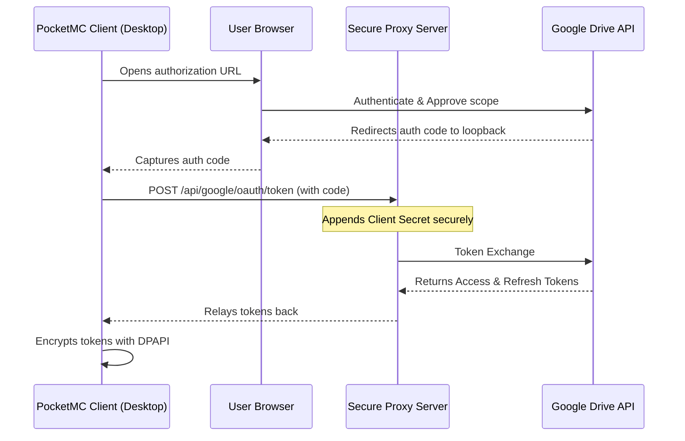

# PocketMC Cloud Backups

PocketMC supports automated native cloud backups to **Google Drive**, **Dropbox**, and **OneDrive**. This feature provides a robust layer of disaster recovery independent of local storage, allowing your server worlds to be safely stored off-site and restored with a single click.

---

## Features
- **Native Integration:** Direct communication with cloud providers (no generic sync folders or external software required).
- **Secure Storage:** All OAuth access and refresh tokens are securely encrypted using Windows Data Protection API (DPAPI) at rest, bound to your Windows user account.
- **Resilient Uploads & Downloads:** Heavy network processes run asynchronously in the background using an exponential backoff retry policy to handle transient network hiccups gracefully.
- **Large File Support:** Uses chunked upload sessions to bypass HTTP constraints and handle backups of massive world archives seamlessly.
- **Automated Retention:** Automatically prunes old backups per provider based on your configured retention count.
- **One-Click Restoration:** Download and restore remote cloud backups directly from the interface.

---

## Architectural Flow & Security

PocketMC uses a **secure hybrid authentication architecture** to maintain confidentiality and safety:

- **Dropbox & OneDrive:** Authenticate natively using **PKCE (Proof Key for Code Exchange)** directly from the desktop client to the providers. No client secrets are needed, guaranteeing 100% security on public clients.
- **Google Drive:** Uses a secure, open-source C# backend proxy server (`PocketMC.PlayitPartnerProxy`) to manage the Client Secret. This prevents embedding credentials in the open-source client codebase while keeping the integration completely transparent.

---

## Configuration & Usage

### 1. Global App Settings (Connect Accounts)
Navigate to **Settings -> Cloud Backups** to authorize your accounts.
- Click **Connect** next to the provider you want to use.
- A secure local loopback browser will open for authorization.
- Enable `Upload on Manual Backup` and/or `Upload on Scheduled Backup` as needed.

### 2. Instance Settings (Server Configuration)
Navigate to a server's **Settings -> Backups** page to manage instance-specific configurations.
- **Enable Sync:** Toggle specific providers for the current server.
- **Retention Count:** Set the maximum number of archives to keep on the cloud provider for this server instance.
- **Restore Backup:** Click **Restore** next to any remote backup.
  > [!IMPORTANT]
  > To prevent data corruption, **restoring a cloud backup is only permitted when the Minecraft server is stopped**. The Restore button is automatically disabled while the server is running.
  > When initiated, PocketMC will download the cloud ZIP to a temporary file in the local `backups/` folder, extract it to overwrite the server files, and cleanly delete the temporary archive.

---

## Developer & Self-Hosting Guide

If you are compiling your own builds of PocketMC and want to configure your own cloud applications:

### Google Drive
1. Create a project in the [Google Cloud Console](https://console.cloud.google.com/).
2. Navigate to **APIs & Services ➔ Credentials** and create an OAuth Client ID of type **Web application**.
3. Add `http://127.0.0.1:49384/callback` to the **Authorized redirect URIs**.
4. Configure your client secret in the `PocketMC.PlayitPartnerProxy` backend project environment configuration (`GOOGLE_CLIENT_ID` and `GOOGLE_CLIENT_SECRET`).
5. **Testing Mode Note:** While your Google app is in "Testing" status, you **must** add your email address to the **Test Users** section under the OAuth Consent Screen, otherwise Google will block the sign-in with an "Access Blocked" error page.

### Dropbox
1. Create an app in the [Dropbox App Console](https://www.dropbox.com/developers/apps).
2. Choose **Scoped access** and **App folder** or **Full Dropbox** access.
3. Under **Permissions**, enable `files.metadata.read`, `files.metadata.write`, `files.content.read`, and `files.content.write`.
4. Under **Settings**, add `http://localhost/` as a Redirect URI.

### OneDrive
1. Register an application in the [Microsoft Entra ID (Azure) portal](https://portal.azure.com/).
2. Choose **Accounts in any organizational directory and personal Microsoft accounts** (Multi-tenant & Personal).
3. Under **Authentication**, add a **Mobile and desktop applications** platform redirect URI: `http://localhost`.
4. Ensure the API permissions include standard Delegated permissions for `Files.ReadWrite.AppFolder` (or `Files.ReadWrite` if using full access).
